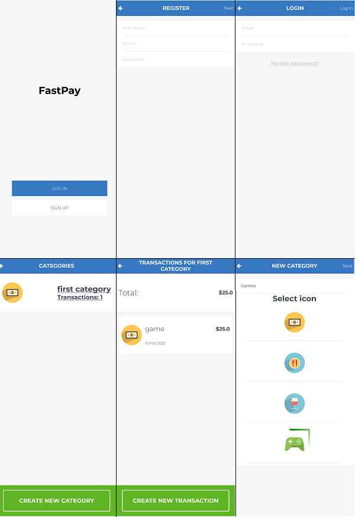

# Fastpay

> Fastpay is a budget app made entirely in rails, it includes authentication, authorization, the database model, a page to see and create categories and to see and create transactions

## Built With

- Ruby on Rails
- HTML
- CSS

## Live Demo (if available)

[Live Demo Link](https://leolpaz-fastpay.herokuapp.com/)

## Screenshot

## Getting Started

To get a local copy up and running follow these simple example steps.

### Prerequisites

- IDE of your choice
- WSL or Linux boot
- Ruby
- rbenv
- Postgresql
- Heroku accont(Only for personal deployment)

### Setup

- Make sure you have Ruby and Postgresql installed and set up
- Clone the repository with git clone https://github.com/leolpaz/FastPay.git

### Install

- Run bundle install

### Usage

- Run rails s to open the local server
  #### Or
- Run rails c to open the local app console

### Run tests

- Run rspec spec (rspec and capybara comes bundled up in the Gemfile)

### Deployment

- Use the already deployed project
 #### To deploy from your own fork
- Run the command heroku create (Needs to be logged in, use heroku login if needed)
- Run git push heroku <branch name>
- heroku run rails db:migrate
- heroku open

## Author

👤 **Leonardo Paz**

- Github: [Leonardo Paz](https://github.com/leolpaz)
- Linkedin: [Leonardo Paz](https://www.linkedin.com/in/leonardolpaz/)

## 🤝 Contributing

Contributions, issues, and feature requests are welcome!

Feel free to check the [issues page](../../issues/).

## Show your support

Give a ⭐️ if you like this project!

## Acknowledgments

- Design by [Gregoire Vella on Behance](https://www.behance.net/gregoirevella)

## 📝 License

This project is [MIT](./MIT.md) licensed.
